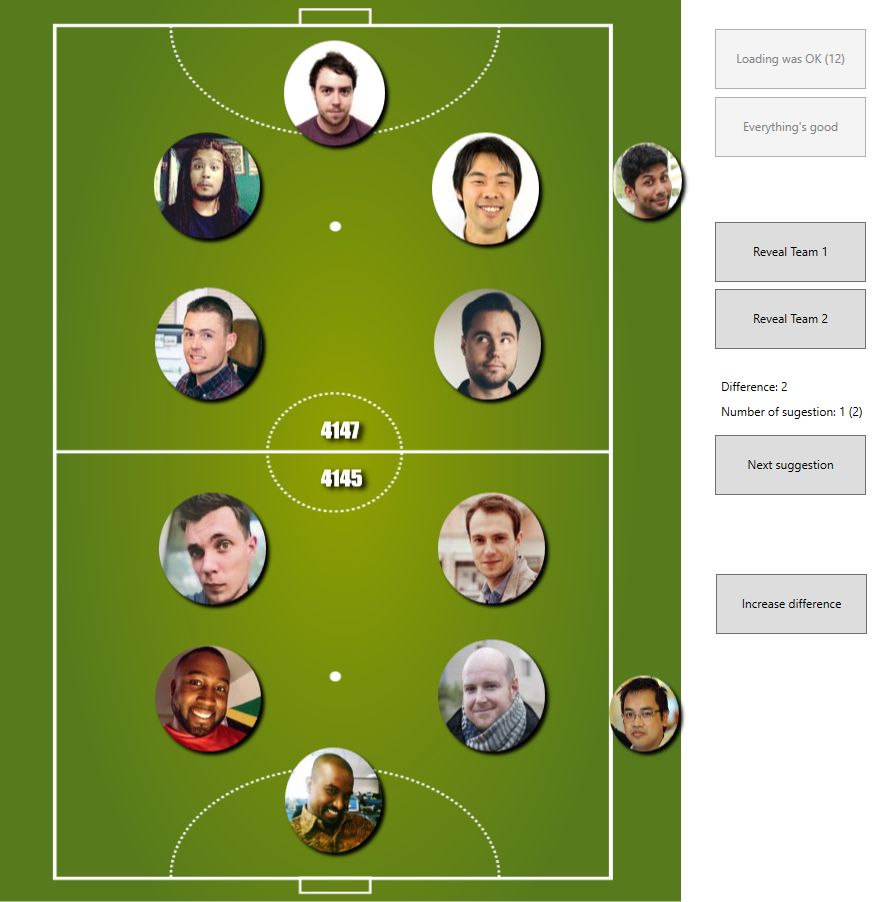

# Perfectly Balanced Teams
Tool for finding two teams with the same skill. 

Player names from Playersdata/playersData.txt need to match players image file name in Images/Players folder (e.g. if you have row in playersData.txt looking like *john, 950* then image should be called *john.jpg*).
# Example

